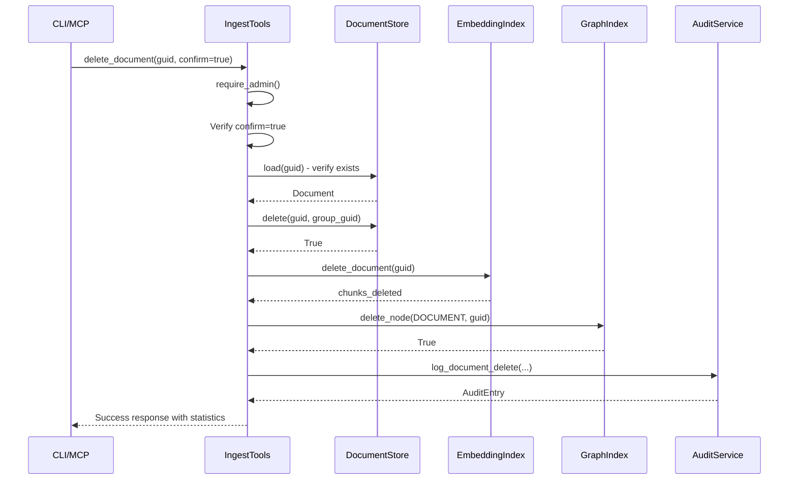

# Document Hard Delete Feature Proposal

**Status**: ✅ Implemented  
**Author**: GOFR-IQ Development  
**Date**: January 13, 2026  
**Version**: 1.1 (Implementation Complete)

---

## 1. Overview

### 1.1 Problem Statement

The GOFR-IQ system currently lacks a way for administrators to permanently delete documents and their associated data. Documents are stored across three storage layers:

1. **Document Store** - Canonical JSON files on disk
2. **Embedding Index** - Vector embeddings in ChromaDB
3. **Graph Index** - Knowledge graph entries in Neo4j

While the underlying deletion methods exist in each service, there is no exposed interface for administrators to perform complete document deletion.

### 1.2 Business Need

- **Data Retention Compliance**: GDPR/CCPA right to deletion
- **Data Quality**: Remove corrupted or erroneous documents
- **Testing & Development**: Clean up test data
- **Storage Management**: Reclaim storage space from obsolete data

### 1.3 Proposed Solution

Add a comprehensive document hard delete capability exposed through:
1. MCP Tool (`delete_document`) 
2. CLI Command (`manage_document.sh delete`)
3. Full audit logging for compliance

---

## 2. Technical Specification

### 2.1 Scope

**In Scope**:
- Hard delete of document from all three storage layers
- Admin-only access control
- Safety confirmation requirement
- Audit trail logging
- CLI interface

**Out of Scope** (Future Consideration):
- Soft delete / defunct marking
- Batch deletion
- Scheduled deletion

### 2.2 Components Affected

| Component | File | Change Type |
|-----------|------|-------------|
| MCP Tools | `app/tools/ingest_tools.py` | Add `delete_document` tool |
| Audit Service | `app/services/audit_service.py` | Add `log_document_delete` function |
| CLI Script | `scripts/manage_document.sh` | Add `delete` command |
| Tests | `test/test_document_delete.py` | New test file |
| Documentation | `docs/features/` | This proposal + usage docs |

### 2.3 API Design

#### MCP Tool: `delete_document`

```python
@mcp.tool(name="delete_document")
def delete_document(
    document_guid: str,      # Required: UUID of document to delete
    group_guid: str,         # Required: Group containing the document  
    date_hint: str | None,   # Optional: YYYY-MM-DD to speed lookup
    confirm: bool,           # Required: Must be True to execute
    auth_tokens: list[str],  # Required: Admin JWT token
) -> ToolResponse:
    """Permanently delete document from all storage layers."""
```

**Parameters**:
| Parameter | Type | Required | Description |
|-----------|------|----------|-------------|
| `document_guid` | UUID string | Yes | Document to delete |
| `group_guid` | UUID string | Yes | Group containing document |
| `date_hint` | YYYY-MM-DD | No | Speeds up file lookup |
| `confirm` | boolean | Yes | Must be `true` to execute |
| `auth_tokens` | string array | Yes | Admin JWT token |

**Response**:
```json
{
  "success": true,
  "message": "Document 'Article Title' permanently deleted from all storage layers",
  "data": {
    "document_guid": "550e8400-e29b-41d4-a716-446655440000",
    "title": "Article Title",
    "group_guid": "a1b2c3d4-e5f6-7890-abcd-ef1234567890",
    "deleted_from": ["document_store", "embedding_index (15 chunks)", "graph_index"],
    "vector_chunks_deleted": 15
  }
}
```

**Error Codes**:
| Code | Condition |
|------|-----------|
| `AUTH_REQUIRED` | No valid token provided |
| `ACCESS_DENIED` | User not in admin group |
| `DOCUMENT_NOT_FOUND` | Document doesn't exist |
| `CONFIRMATION_REQUIRED` | `confirm` parameter not true |
| `DELETION_FAILED` | Storage layer deletion failed |

#### CLI Command: `manage_document.sh delete`

```bash
./scripts/manage_document.sh delete \
  --document-guid "550e8400-e29b-41d4-a716-446655440000" \
  --group-guid "a1b2c3d4-e5f6-7890-abcd-ef1234567890" \
  [--date "2026-01-13"] \
  --confirm \
  --token "$GOFR_IQ_ADMIN_TOKEN"
```

### 2.4 Security Model

| Requirement | Implementation |
|-------------|----------------|
| Admin Only | `require_admin()` check |
| Confirmation | `confirm=true` parameter required |
| Audit Trail | Every deletion logged with actor, timestamp, details |
| Token Required | JWT authentication mandatory |

### 2.5 Deletion Sequence



---

## 3. Implementation Plan

### 3.1 Phase 1: Core Implementation

| Step | Task | File | Status |
|------|------|------|--------|
| 1.1 | Add `DOCUMENT_DELETE` event type | `app/services/audit_service.py` | ✅ DONE |
| 1.2 | Add `log_document_delete` audit function | `app/services/audit_service.py` | ✅ DONE |
| 1.3 | Export `log_document_delete` | `app/services/__init__.py` | ✅ DONE |
| 1.4 | Add `delete_document` MCP tool | `app/tools/ingest_tools.py` | ✅ DONE |
| 1.5 | Add `delete` command to CLI | `scripts/manage_document.sh` | ✅ DONE |

### 3.2 Phase 2: Testing

| Step | Task | File | Status |
|------|------|------|--------|
| 2.1 | Unit tests for deletion | `test/test_document_delete.py` | ✅ DONE |
| 2.2 | Integration tests with all services | `test/test_document_delete.py` | ✅ DONE |
| 2.3 | CLI test script | Manual verification | ⬜ TODO |

### 3.3 Phase 3: Documentation

| Step | Task | Status |
|------|------|--------|
| 3.1 | Update this proposal with implementation status | ✅ DONE |
| 3.2 | Add usage examples to docs | ✅ DONE (below) |

---

## 4. Testing Strategy

### 4.1 Unit Tests

| Test | Description | Status |
|------|-------------|--------|
| `test_delete_document_success` | Complete deletion works | ✅ |
| `test_delete_nonexistent_document_returns_false` | Non-existent returns False | ✅ |
| `test_delete_with_date_hint` | Date hint speeds lookup | ✅ |
| `test_delete_removes_file_from_disk` | File is actually removed | ✅ |
| `test_log_document_delete_creates_entry` | Audit entry created | ✅ |
| `test_log_document_delete_persists_to_storage` | Audit persisted | ✅ |
| `test_log_document_delete_without_optional_fields` | Optional fields work | ✅ |
| `test_delete_from_document_store_via_service` | Service integration | ✅ |
| `test_delete_requires_confirmation` | Tool checks confirm | ✅ |
| `test_delete_requires_admin_in_description` | Admin only documented | ✅ |
| `test_delete_document_idempotent` | Second delete returns False | ✅ |
| `test_delete_with_wrong_group_guid_fails` | Wrong group fails | ✅ |
| `test_load_deleted_document_raises_error` | Load after delete fails | ✅ |
| `test_embedding_delete_returns_chunk_count` | Chunks counted | ✅ |
| `test_embedding_delete_nonexistent_returns_zero` | No chunks = 0 | ✅ |
| `test_graph_delete_returns_true_on_success` | Graph delete works | ✅ |
| `test_graph_delete_returns_false_when_not_found` | Not found = False | ✅ |
| `test_complete_delete_workflow_document_store_only` | End-to-end workflow | ✅ |
| `test_delete_multiple_documents` | Batch sequential delete | ✅ |

**Test Results**: 19 passed, 0 failed

### 4.2 Integration Tests

| Test | Description |
|------|-------------|
| `test_delete_via_mcp_protocol` | Full MCP request/response |
| `test_delete_query_returns_empty_after_delete` | Document not queryable |

### 4.3 Manual CLI Tests

```bash
# Test 1: Missing confirmation shows warning
./scripts/manage_document.sh delete \
  --document-guid "test-guid" \
  --group-guid "test-group" \
  --token "$TOKEN"
# Expected: Warning about missing --confirm

# Test 2: Successful deletion
./scripts/manage_document.sh delete \
  --document-guid "actual-guid" \
  --group-guid "actual-group" \
  --confirm \
  --token "$ADMIN_TOKEN"
# Expected: Success message with deletion stats
```

---

## 5. Risk Assessment

| Risk | Impact | Mitigation |
|------|--------|------------|
| Accidental deletion | High | Require explicit `--confirm` flag |
| Unauthorized deletion | High | Admin-only access control |
| Incomplete deletion | Medium | Verify document exists before starting |
| No recovery | High | Clear documentation, audit logging |

---

## 6. Future Enhancements

### 6.1 Soft Delete (Phase 2)

Add document status field for soft-delete:
```python
class DocumentStatus(str, Enum):
    ACTIVE = "active"
    DEFUNCT = "defunct"
    SUPERSEDED = "superseded"
```

### 6.2 Batch Deletion (Phase 3)

```python
@mcp.tool(name="delete_documents_batch")
def delete_documents_batch(
    document_guids: list[str],
    confirm: bool,
    auth_tokens: list[str],
) -> ToolResponse:
    """Delete multiple documents in batch."""
```

### 6.3 Scheduled Deletion (Phase 4)

Automatic deletion of defunct documents after retention period.

---

## 7. Changelog

| Version | Date | Changes |
|---------|------|---------|
| 1.0 | 2026-01-13 | Initial proposal |
| 1.1 | 2026-01-13 | Implementation complete - MCP tool, CLI, audit logging, tests |

---

## 8. Appendix

### 8.1 Implementation Files

The following files were created or modified:

| File | Type | Description |
|------|------|-------------|
| `app/tools/ingest_tools.py` | Modified | Added `delete_document` MCP tool (~150 lines) |
| `app/services/audit_service.py` | Modified | Added `DOCUMENT_DELETE` event type and `log_document_delete` function |
| `app/services/__init__.py` | Modified | Exported `log_document_delete` |
| `scripts/manage_document.sh` | Modified | Added `delete` command with argument parsing |
| `test/test_document_delete.py` | Created | Comprehensive test suite (~500 lines) |
| `docs/features/document_hard_delete_proposal.md` | Created | This proposal document |

### 8.2 Existing Deletion Methods

The following methods already existed and are used by the implementation:

```python
# DocumentStore (app/services/document_store.py)
def delete(self, guid: str, group_guid: str, date: datetime | str | None = None) -> bool:
    """Delete a document from the store. Returns True if deleted."""

# EmbeddingIndex (app/services/embedding_index.py)  
def delete_document(self, document_guid: str) -> int:
    """Delete all chunks for a document. Returns count of chunks deleted."""

# GraphIndex (app/services/graph_index.py)
def delete_node(self, label: NodeLabel, guid: str) -> bool:
    """Delete a node and its relationships. Returns True if deleted."""
```

### 8.3 Related Documentation

- [Group Access Control](group-access.md) - Permission matrix
- [Authentication](../architecture/authentication.md) - Token validation
- [Implementation Details](../reference/implementation-details.md) - Storage architecture
