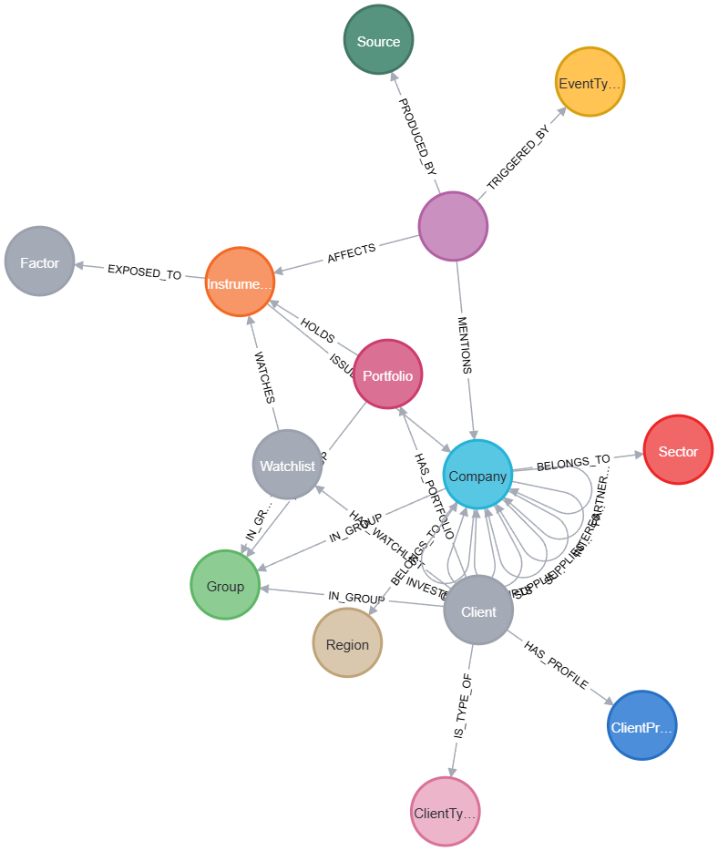

# GOFR-IQ Functional Summary: Client-Centric Intelligence Platform

**Date:** October 2023
**Target Audience:** Technical Stakeholders, Trading Desk Heads, System Architects
**Context:** Cash Equities Sales Trading & Research

---

## 1. Summary

GOFR-IQ is a **Graph/Vector RAG (Retrieval-Augmented Generation)** platform designed to transform raw financial documents into actionable, client-specific trading intelligence. Unlike traditional search engines that return lists of documents based on keywords, GOFR-IQ identifies **relationships** between market events, companies, and investment portfolios to answer the critical question: *"Who cares about this news, and why?"*

By combining **semantic search** via a Vector Database (finding thematically related content) with **horizontal knowledge graph traversals** (tracing supply chains, ownership, and competition), the system balances abstract meaning with concrete relationships to deliver hyper-personalized insights for cash equities sales traders.

---

## 2. The Knowledge Graph Core

The heart of GOFR-IQ is a rich property graph (Neo4j) that models the financial ecosystem. It maps 14 distinct entity types connected by 25 relationship types, creating a semantic layer over unstructured data.

### 2.1 Schema Overview

*See `graph-as-csv.csv` for textual specification of all nodes and relationships.*

*   **Market Entities:** `Company`, `Sector`, `Region`, `Instrument` (Tickers)
*   **Content:** `Document`, `Source`, `Event`
*   **Client Context:** `Client`, `ClientProfile`, `Portfolio`, `Watchlist`
*   **Relationships:**
    *   **Direct:** `(:Company)<-[:ISSUED_BY]-(:Document)`, `(:Client)-[:HOLDS]->(:Portfolio)`
    *   **Inferred:** `(:Company)-[:SUPPLIES_TO]->(:Company)`, `(:Event)-[:AFFECTS]->(:Sector)`
    *   **Derived:** `(:Event)-[:TRIGGERED_BY]->(:Event)` (Causal chains)

### 2.2 Vector Integration
Every `Document` node in the graph is paired with a **1536-dimensional vector embedding** (stored in ChromaDB). This architecture allows queries to strike a precise **balance between semantic understanding and horizontal graph exploration**:

1.  **Vector Search (Semantic):** Uses the Vector DB to find "hidden" thematic links (e.g., "AI regulation" relates to "chip manufacturing") based on meaning rather than keywords.
2.  **Graph Search (Structural):** Validates explicit horizontal links across the network (e.g., "Nvidia supplies to Microsoft" or "Competes with AMD").

---

## 3. Data Ingestion Pipeline (The "Write" Path)
*(See [Document Ingestion Pipeline](document-ingestion.md) for full architectural details)*

Data enters the system via a rigorous 10-step pipeline managed by the `Ingestion Service`.

1.  **Validation & Metadata:** Inputs are checked for integrity; metadata (date, region) is normalized.
2.  **Vector Indexing:** Content is embedded via `qwen/qwen3-embedding-8b` and stored in ChromaDB for similarity search.
3.  **Graph Indexing:** A simplified node is created in Neo4j.
4.  **LLM Extraction:** An LLM extracts structured entities (Companies, Events, Sentiments) from the chaotic text.
5.  **Graph Enrichment:** Extracted entities are linked to the canonical graph, establishing relationships like `(:Document)-[:MENTIONS]->(:Company)` and `(:Document)-[:REPORTS]->(:Event)`.

**Result:** A raw press release effectively "lights up" a section of the knowledge graph, connecting it to every company, sector, and client portfolio it touches.

---

## 4. Client Intelligence & MCP Tools

External agents (and the web UI) interact with GOFR-IQ via the **Model Context Protocol (MCP)**. This standard interface exposes granular tools for managing client lifecycle and retrieving intelligence.

### 4.1 Client Management Tools
*(See [Client Types](client-types.md) for definitions of Hedge Fund vs. Long-Only profiles)*

*   `create_client`: Define a new client entity.
*   `update_client_profile`: rigorous controls for client types (Hedge Fund vs. Pension Fund).
*   `list_clients` / `get_client_profile`: Retrieval of static data.

### 4.2 Portfolio & Interest Management
*   `add_to_portfolio` / `get_portfolio_holdings`: Manage explicit positions (Holdings).
*   `add_to_watchlist` / `get_watchlist_items`: Manage soft interests (Watchlists).

**Business Logic:** These inputs define the "Interest Graph". A client holding "AAPL" is implicitly interested in:
*   Apple (Direct)
*   Foxconn (Supplier - 1st degree)
*   Samsung (Competitor - 1st degree)
*   Consumer Electronics (Sector)

### 4.3 Intelligence Retrieval
*(See [Client Feeds & Personalization](client-feeds.md) for scoring algorithms and delivery architecture)*

*   `get_client_feed`: The primary output tool. It accepts a `client_guid` and returns a ranked, personalized list of stories.

### 4.4 MCP Interface & Graph Model Interaction

The MCP interface acts as the functional control plane for the knowledge graph, mapping user actions directly to graph operations:

| Function Category | MCP Tool Calls | Graph Model Operations (Neo4j) |
|-------------------|----------------|--------------------------------|
| **Ingestion** | `ingest_document` | Defines `(:Document)` nodes; creates `[:ISSUED_BY]` source links; LLM extraction triggers `[:MENTIONS]` and `[:AFFECTS]` relationships to Market Entities. |
| **Client Lifecycle** | `create_client` | Instantiates `(:Client)` node; auto-creates linked `(:Portfolio)` and `(:Watchlist)` containers for storing interests. |
| **Portfolio Mgmt** | `add_to_portfolio` | Creates `[:HOLDS]` relationships between `(:Portfolio)` and `(:Instrument)` nodes, effectively "subscribing" the client to that company's entire supply chain graph. |
| **Feed Generation** | `get_client_feed` | Executes a **multi-hop traversal**: Starting at `(:Client)`, it walks `[:HOLDS]->[:Instrument]->[:ISSUED_BY]->(:Company)` to find relevance, then ranks by Impact Score. |
| **Entity Resolution** | `list_companies` | Queries the `(:Company)` and `(:Instrument)` reference data to ensure tickers (e.g., "AAPL") map correctly to canonical graph IDs. |

---

## 5. Signal Generation (The "Read" Path)

How does GOFR-IQ find the "right story"?

### 5.1 Hybrid Search & Ranking
*(See [Hybrid Search](hybrid-search.md) and [Impact Ranking](impact-ranking.md) for deep dives)*

When a query (or feed request) is executed:
1.  **Scope**: System identifies the User Group (e.g., "APAC Desk") for security.
2.  **Retrieval**:
    *   **Vector**: Finds top 100 semantically relevant documents.
    *   **Graph**: Expands to find documents linked to the client's Portfolio/Watchlist via knowledge graph paths.
3.  **Scoring (Impact Algorithm)**:
    *   `Relevance_Score = (Impact_Score × Time_Decay) + Position_Boost + Benchmark_Boost`
    *   **Impact Score**: Based on Tier (Platinum to Standard) – e.g., M&A > Earnings > Marketing.
    *   **Time Decay**: Platinum events decay slowly (14 days); Standard events decay fast (2 days).
    *   **Context Boost**: Stories about a Top 10 holding get a massive scoring multiplier (50x weight).

### 5.2 RAG (Retrieval Augmented Generation)
For narrative generation (e.g., "Draft a sales email"), the system uses the retrieved, highly-ranked documents as context window injection. The LLM then generates a summary explicitly tied to the client's known interests.

**Example:**
*   **Input**: "Supply chain disruption in Taiwan"
*   **Graph Path**: *Disruption* -> *TSMC* -> *Supplies To* -> *Apple* -> *Held By* -> *Client A*
*   **Output**: "Client A, you should know that Taiwan supply chain issues may impact your Apple position."

---

## 6. Access Control & Security
*(See [Group Access Control](group-access.md) for permission matrices and token schemas)*

*   **Group Isolation**: Data is strictly segregated. An "APAC Research" user cannot see "US Trading" documents or clients.
*   **JWT Auth**: All MCP calls utilize JSON Web Tokens containing group claims.
*   **Source Globalism**: While documents are private, `Source` reputation entities are global, allowing shared trust metrics across the platform.

---

## 7. Strategic Value for Sales Trading

1.  **Coverage Scale**: One trader can monitor 500+ portfolios simultaneously.
2.  **Discovery**: Uncovers 2nd and 3rd order effects (e.g., Supplier's Supplier) that manual reading misses.
3.  **Speed**: Moves from "News Flash" to "Client Call List" in milliseconds.
