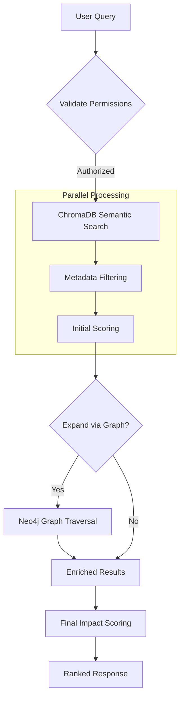

# Hybrid Search Explained

GOFR-IQ uses a **Hybrid Search** engine that combines vector database semantic search with knowledge graph traversals. This approach solves two common problems in RAG systems:
1. "Unknown Unknowns" (missing context that semantic similarity doesn't catch)
2. Hallucinations (grounding answers in verified relationships)

---

## 1. How It Works

The search process follows a 6-step pipeline:



### Step 1: Semantic Search (The "What")
Finds documents conceptually similar to the query using vector embeddings.
- **Engine**: ChromaDB
- **Target**: Finding direct matches for the user's intent.
- *Example*: Query "Auto supply chain" matches "Car parts shortage" due to vector similarity.

### Step 2: Graph Expansion (The "Who & How")
Finds documents related via real-world relationships, even if the text doesn't match.
- **Engine**: Neo4j
- **Traversal logic**:
  - `AFFECTS`: Find docs affecting the same instruments
  - `PEER_OF`: Find docs affecting competitor/peer companies
  - `TRIGGERED_BY`: Find docs with same event type
  - `MENTIONS`: Find docs mentioning related companies
- *Example*: "Auto supply chain" expands to find a "Chip shortage" document because both affect "Ford Motor Co".

---

## 2. Scoring & Ranking

Results are ranked using a weighted formula that prioritizes **Trust** and **Impact** over raw semantic similarity.

| Component | Weight | Description |
|-----------|--------|-------------|
| **Semantic** | 60% | How well the text matches the query |
| **Trust** | 20% | Source credibility (Platinum > Unverified) |
| **Recency** | 10% | Newer news is more valuable (halves every 30 days) |
| **Graph Boost** | 10% | Bonus for items discovered via graph relationships |

### Trust Levels
- **High (1.0)**: Platinum sources (Bloomberg, Reuters)
- **Medium (0.75)**: Verified regional news
- **Low (0.5)**: Blogs, aggregators
- **Unverified (0.25)**: Social media, unverified tips

---

## 3. Query Filters

You can refine searches using strict metadata filters:

- **Impact Tier**: `PLATINUM`, `GOLD`, `SILVER`, `BRONZE`
- **Region**: `APAC`, `US`, `EMEA`
- **Sector**: `TECH`, `ENERGY`, `FINANCE`
- **Event Type**: `EARNINGS`, `MERGER`, `SUPPLY_CHAIN`
- **Date Range**: `date_from` / `date_to`

---

## 4. Usage Example

### Python API
```python
from app.services.query_service import QueryFilters

# Strict filter for high-impact tech news
filters = QueryFilters(
    sectors=["TECH"],
    impact_tiers=["PLATINUM", "GOLD"],
    regions=["APAC"]
)

results = query_service.query(
    query_text="semiconductor shortage",
    group_guids=["apac-sales"], 
    filters=filters,
    enable_graph_expansion=True
)
```

### JSON Response Structure
```json
{
  "results": [
    {
      "title": "TSMC Production Halted",
      "score": 0.85,
      "discovered_via": "semantic",
      "impact_tier": "PLATINUM"
    },
    {
      "title": "Ford Cuts Production",
      "score": 0.72,
      "discovered_via": "graph",
      "graph_context": {
        "via": "peer:TSMC->Samsung"
      }
    }
  ]
}
```

---

## 5. Using via OpenWebUI

When interacting with GOFR-IQ through a chat interface (like OpenWebUI), you don't need to write code. The LLM translates your natural language into the appropriate API calls.

### Example Conversation
**User:** "Show me high-impact tech news for my APAC clients."

**LLM (Internal Thought Process):** 
1. User wants *news* → Use `query_documents`
2. "High-impact" → Filter `impact_tiers=["PLATINUM", "GOLD"]`
3. "Tech" → Filter `sectors=["Technology"]`
4. "APAC clients" → Filter `regions=["APAC"]`

**LLM Tool Call:**
```python
query_documents(
    query="technology news",
    sectors=["Technology"],
    regions=["APAC"],
    impact_tiers=["PLATINUM", "GOLD"],
    include_graph_context=True
)
```

### Investigating "Why"
If you see a result that doesn't seem to match your keywords:

**User:** "Why did you show me the 'Strike at Port of Los Angeles' article? I asked for generic supply chain news."

**Assistant:** "I included that article because our **Knowledge Graph** linked it to your interests:
- You hold **Samsung Electronics** stock.
- The graph shows: `(Samsung)-[:SUPPLIED_VIA]->(Port of Los Angeles)`.
- Therefore, a strike at this port directly impacts your portfolio items."

---

## 6. Why Graph Expansion Matters

Without graph expansion, a query for *"Apple Suppliers"* might miss a critical strike at a *"Foxconn"* factory if the article doesn't explicitly mention "Apple".

With **Graph Expansion**:
1. Semantic search finds "Apple" documents.
2. Graph sees `(Apple)-[:SUPPLIED_BY]->(Foxconn)`.
3. Graph traverses to find `(Document)-[:MENTIONS]->(Foxconn)`.
4. Result: The user sees the Foxconn strike news, even though they searched for Apple.

---

## Stage 2: Metadata Filtering

Filters documents before scoring, reducing computation:

| Filter | Type | Description | Example |
|--------|------|-------------|---------|
| **Date Range** | `date_from`, `date_to` | Filter by creation date | Last 7 days |
| **Impact Tier** | `impact_tiers` | PLATINUM, GOLD, SILVER, BRONZE, STANDARD | PLATINUM only |
| **Impact Score** | `min_impact_score` | Numeric threshold (0-100) | ≥ 70 |
| **Regions** | `regions` | Geographic areas | ["APAC", "Japan"] |
| **Sectors** | `sectors` | Industry classification | ["technology", "finance"] |
| **Companies** | `companies` | Ticker/name list | ["AAPL", "0700"] |
| **Sources** | `sources` | Source GUIDs | Specific news providers |
| **Languages** | `languages` | Language codes | ["en", "zh"] |
| **Event Types** | `event_types` | Event codes | ["EARNINGS_BEAT", "M&A_ANNOUNCE"] |

### Filter Example

```python
from app.services.query_service import QueryFilters
from datetime import datetime, timedelta

# Create filters
filters = QueryFilters(
    date_from=datetime.now() - timedelta(days=7),  # Last 7 days
    impact_tiers=["PLATINUM", "GOLD"],  # High impact only
    regions=["APAC"],
    sectors=["technology"],
    min_impact_score=70
)

# Apply via query
results = query_service.search(
    query="earnings announcement",
    group_guid="apac-research",
    filters=filters
)
```

---

## Stage 3: Graph Enrichment (Optional)

Enhances results by traversing Neo4j relationships:

### What Gets Enriched

For each document returned from semantic search:

| Enrichment | Relationships | Example |
|-----------|------------------|---------|
| **Instruments** | Document -[AFFECTS]→ Instrument | Which stocks affected |
| **Companies** | Document -[MENTIONS]→ Company | Companies mentioned |
| **Events** | Document -[TRIGGERED_BY]→ EventType | Event category |
| **Related Docs** | Document ↔ (shared entity) | Similar documents |

### Example Enrichment Output

```json
{
  "document_guid": "550e8400-...",
  "title": "Apple Reports Q4 Earnings Beat",
  "similarity_score": 0.89,
  "graph_context": {
    "instruments_affected": [
      {
        "ticker": "AAPL",
        "direction": "UP",
        "magnitude": 0.05,
        "confidence": 0.92
      }
    ],
    "companies_mentioned": [
      {"name": "Apple", "ticker": "AAPL"},
      {"name": "Samsung", "ticker": "005930"}
    ],
    "event_type": {
      "code": "EARNINGS_BEAT",
      "name": "Earnings Beat",
      "base_impact": 70
    },
    "related_documents": [
      {"guid": "...", "relationship": "shared_company", "title": "..."},
      {"guid": "...", "relationship": "shared_instrument", "title": "..."}
    ]
  }
}
```

---

## Stage 4: Hybrid Scoring

### Formula

```
final_score = w_semantic * semantic_score
            + w_trust * trust_score
            + w_recency * recency_score
            + w_graph * graph_score
            [+ w_client * client_score]  # If client provided
```

Where weights sum to 1.0 (or <1.0 if client score included)

### Scoring Components

#### 1. Semantic Score (0-1)
**Source**: Raw cosine similarity from ChromaDB

```python
semantic_score = similarity_from_embeddings  # [0, 1]
```

**Interpretation**: How well does the document match the query text?

#### 2. Trust Score (0-1)
**Source**: Source trust level

```python
trust_levels = {
    "high":    1.0,      # Bloomberg, Reuters, AP
    "medium":  0.6,      # Industry publications
    "low":     0.3       # Blogs, unverified sources
}

trust_score = trust_levels[source.trust_level]
```

**Interpretation**: How much do we trust the news source?

#### 3. Recency Score (0-1)
**Source**: Time decay from document creation

```
hours_old = (now - created_at).total_seconds() / 3600

recency_score = exp(-0.1 * hours_old)  # Exponential decay
# At 0 hours:  1.0
# At 6 hours:  0.55
# At 24 hours: 0.09
```

**Interpretation**: Fresher documents score higher

#### 4. Graph Score (0-1)
**Source**: Enrichment relationships

```python
graph_bonus = 0.0
if enriched_from_graph:
    # Bonus if document was found via graph expansion
    graph_bonus = 0.15  # 15% boost
    
# Additional bonuses for entity relevance
if document_affects_client_holdings:
    graph_bonus += 0.10
if document_mentions_client_interests:
    graph_bonus += 0.10
    
graph_score = min(graph_bonus, 0.5)  # Cap at 50%
```

**Interpretation**: How relevant is the content within the knowledge graph?

#### 5. Client Score (Optional, 0-1)
**Source**: Neo4j client matching (if client_guid provided)

```python
client_score = 0.0

# Position boost
if document_affects_client_portfolio:
    position_weight = portfolio_position.weight
    client_score += position_weight * 0.3

# Watchlist boost
if document_affects_client_watchlist:
    client_score += 0.2

# Preference boost
if matches_client_preferences:
    client_score += 0.15

client_score = min(client_score, 1.0)
```

**Interpretation**: How relevant is this for this specific client?

### Default Weights

```python
@dataclass
class ScoringWeights:
    semantic: float = 0.60  # 60% from text matching
    trust: float = 0.20     # 20% from source reliability
    recency: float = 0.10   # 10% from freshness
    graph_boost: float = 0.10  # 10% from graph enrichment
```

### Custom Weights Example

```python
from app.services.query_service import ScoringWeights

# Favor freshness for breaking news
breaking_news_weights = ScoringWeights(
    semantic=0.40,
    trust=0.25,
    recency=0.25,  # Doubled recency weight
    graph_boost=0.10
)

# Favor semantics for research
research_weights = ScoringWeights(
    semantic=0.70,
    trust=0.15,
    recency=0.05,   # Lower recency weight
    graph_boost=0.10
)

results = query_service.search(
    query="AI regulation",
    weights=breaking_news_weights
)
```

---

## Stage 5: Result Ranking

### Output Structure

```python
@dataclass
class QueryResult:
    # Document
    document_guid: str
    title: str
    content_snippet: str  # First 500 chars
    created_at: datetime
    language: str
    
    # Scores
    score: float  # Final combined score [0, 1]
    similarity_score: float
    trust_score: float
    recency_score: float
    graph_score: float
    
    # Source
    source_guid: str
    source_name: str
    
    # Impact
    impact_score: float  # 0-100
    impact_tier: str  # PLATINUM/GOLD/SILVER/BRONZE/STANDARD
    event_type: str  # EARNINGS_BEAT, etc.
    
    # Context
    metadata: dict  # Regions, sectors, companies, etc.
    graph_context: dict  # Instruments, entities, related docs
    discovered_via: str  # "semantic", "graph", "both"
```

### Sorting

Results sorted by `score` descending (highest first):

```python
results.sort(key=lambda r: r.score, reverse=True)
```

### Limiting

Default and maximum limits:

```bash
export GOFR_IQ_DEFAULT_SEARCH_LIMIT=10
export GOFR_IQ_MAX_SEARCH_LIMIT=100

# API always returns: min(requested, max)
```

---

## Search Examples

### Example 1: Basic Semantic Search

```python
query_service = QueryService(...)

results = query_service.search(
    query="Apple iPhone 15 launch event",
    group_guid="apac-research",
    limit=10
)

for result in results:
    print(f"{result.score:.3f} | {result.title}")
    print(f"  Source: {result.source_name}")
    print(f"  Impact: {result.impact_tier} ({result.impact_score}/100)")
    print()
```

### Example 2: Filtered Search (PLATINUM Only)

```python
from app.services.query_service import QueryFilters
from datetime import datetime, timedelta

filters = QueryFilters(
    impact_tiers=["PLATINUM"],
    date_from=datetime.now() - timedelta(days=1),
    regions=["APAC"]
)

results = query_service.search(
    query="earnings announcement",
    group_guid="apac-research",
    filters=filters,
    limit=10
)
```

### Example 3: Client-Specific Search

```python
# Search for documents relevant to specific client
results = query_service.search(
    query="earnings",
    group_guid="apac-research",
    client_guid="citadel-guid",  # Personalize for this client
    limit=10
)

# Results boost documents affecting Citadel's portfolio
for result in results:
    print(f"{result.score:.3f} | {result.title}")
    print(f"  Relevance: {result.graph_context}")
```

### Example 4: Graph-Expanded Search

```python
# Search with graph enrichment enabled
results = query_service.search(
    query="semiconductor",
    group_guid="apac-research",
    expand_graph=True,
    limit=20
)

for result in results:
    # Get instrument impacts
    instruments = result.graph_context.get("instruments_affected", [])
    for inst in instruments:
        print(f"  Affects: {inst['ticker']} ({inst['direction']})")
        
    # Get related documents
    related = result.graph_context.get("related_documents", [])
    for rel_doc in related:
        print(f"  Related: {rel_doc['title']}")
```

---

## Performance Characteristics

### Latency by Stage

| Stage | Time | Bottleneck |
|-------|------|-----------|
| Query embedding | 200-500ms | OpenRouter API |
| ChromaDB search | 50-200ms | Vector similarity |
| Metadata filtering | 10-50ms | In-memory |
| Graph enrichment | 100-500ms | Neo4j traversal |
| Result formatting | 10-20ms | Python |
| **Total** | **370-1270ms** | **Query embedding** |

### Optimization Tips

1. **Batch Queries**: Embed multiple queries together
2. **Cache Embeddings**: Store frequent queries
3. **Limit Graph Expansion**: Only for top-10 results
4. **Use Filters**: Pre-filter to reduce graph traversal
5. **Connection Pooling**: Reuse Neo4j/ChromaDB connections

### Scaling

| Measure | Scale | Optimization |
|---------|-------|--------------|
| Documents | 10M+ | Partition by group + date |
| Queries/sec | 100+ | Cache query embeddings, limit graph expansion |
| Graph depth | >5 hops | Materialized views for common patterns |

---

## Best Practices

### 1. Always Validate Group Membership
```python
# Ensure user only searches their permitted groups
permitted_groups = get_user_groups(user_token)
results = query_service.search(
    query=user_query,
    group_guid=permitted_groups[0],  # Always explicit
    limit=limit
)
```

### 2. Use Filters to Reduce Results
```python
# Filter before scoring reduces computation
filters = QueryFilters(
    impact_tiers=["PLATINUM", "GOLD"],
    date_from=datetime.now() - timedelta(days=7)
)

results = query_service.search(
    query=query,
    filters=filters
)
```

### 3. Enable Graph Enrichment Selectively
```python
# Graph expansion is expensive - only for important queries
if query_type == "client_feed":
    # Yes - clients need rich context
    results = query_service.search(..., expand_graph=True)
else:
    # No - simple API search
    results = query_service.search(..., expand_graph=False)
```

### 4. Handle Embedding Failures Gracefully
```python
try:
    results = query_service.search(query)
except EmbeddingError:
    # Fallback to keyword search or return empty
    logger.warning("Embedding failed, using fallback")
    results = keyword_search(query)
```

---

## Related Documentation

- [Architecture Overview](overview.md)
- [Document Ingestion](../features/document-ingestion.md)
- [Graph Design](graph-design.md)
- [Configuration Reference](../getting-started/configuration.md)
